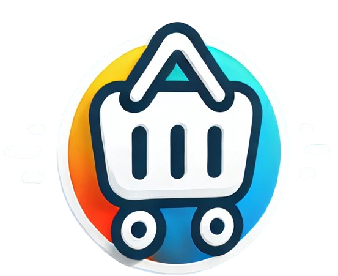
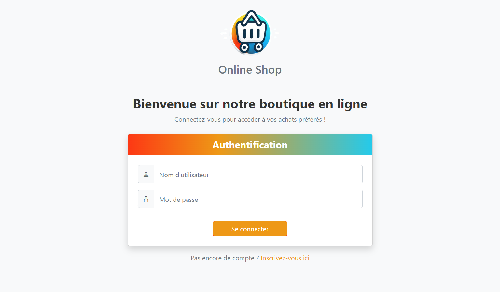
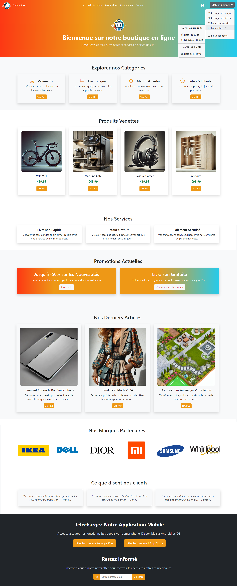
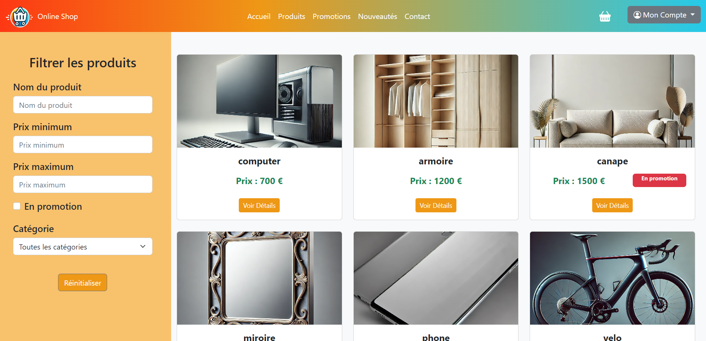
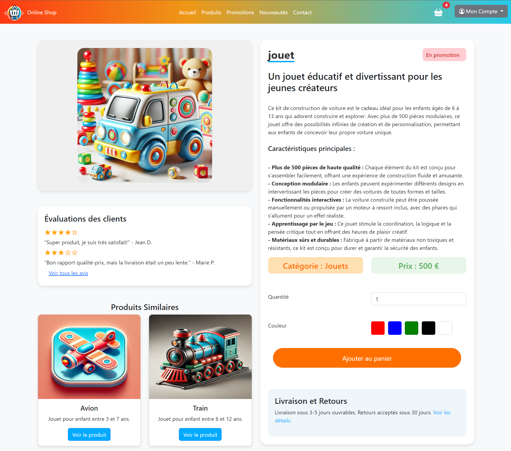
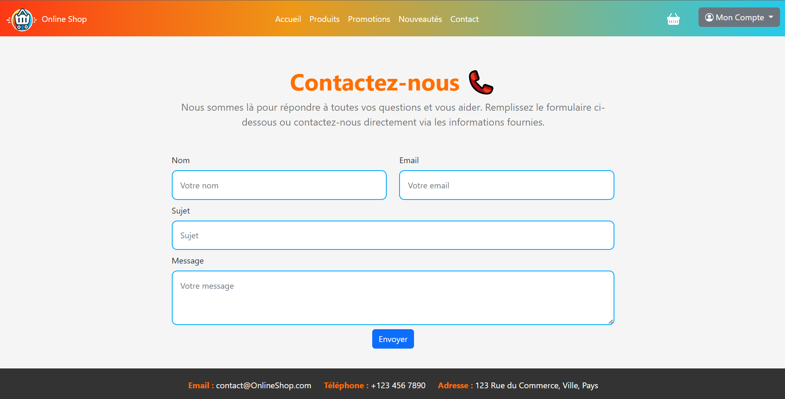
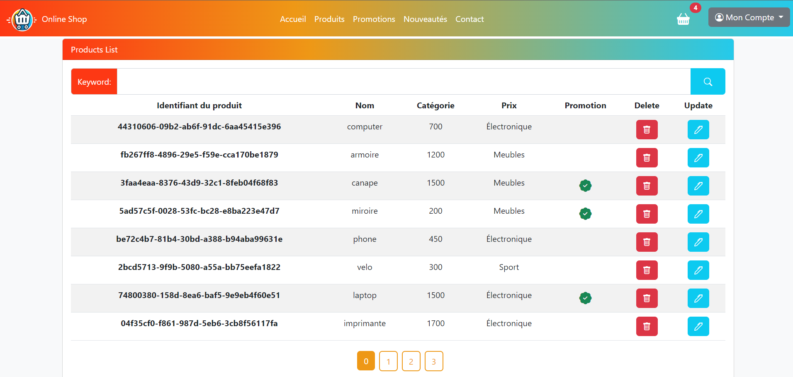
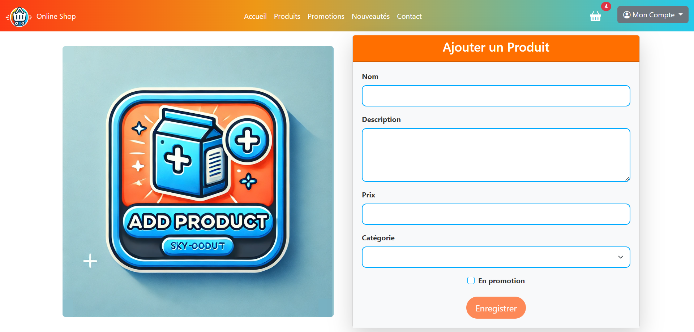

# 🛒 Angular Online Shop

<p align="center">
  
</p>

 


## Description

Welcome to the **Angular Online Shop**! This project is a modern online store developed with **Angular**. It provides a responsive and user-friendly interface for customers to browse products, manage their shopping cart, and complete their orders smoothly and securely. The site is designed for both customers and administrators, who can manage products, promotions, and more.

## 🚀 Features

- 🛍️ **Product Catalog**: Browse a wide range of products with detailed descriptions, images, and prices.
- 🛒 **Shopping Cart Management**: Add, modify, or remove items from your cart with ease.
- 🔒 **Checkout Process**: Securely finalize your purchases through a simple and intuitive checkout process.
- 🔑 **Authentication**: Register and log in for a personalized shopping experience.
- 🎁 **Promotions**: Special offers and discounts are highlighted to enhance the shopping experience.
- 🆕 **New Arrivals**: Stay updated with the latest products added to the store.
- 📞 **Contact Section**: Easily get in touch with the store's support team.

## 🛠️ Technologies Used

- **Angular CLI**: Version 15.1.4 used for scaffolding and managing the project.
- **HTML, CSS, TypeScript**: For building the user interface and application logic.
- **Bootstrap**: For responsive and consistent styling across all pages.

## 📸 Preview

Here are some screenshots of the application:

### 🔑 Authentication

*Login and registration page.*

### 🏠 Home Page

*The homepage showcasing the product catalog and various sections.*

### 🛍️ Product List

*Product list interface for clients.*

### 🛒 Checkout Process

*The checkout page where users can finalize their purchases.*

### 🎁 Promotions

*Section dedicated to ongoing promotions and special offers.*

### 🆕 New Arrivals

*Showcase of the latest products added to the store.*

### 📞 Contact

*Contact page for customer support and inquiries.*

### 🛍️ Product Management

*Product management interface for administrators.*

### 🛍️ Adding New Product

*Product management interface for administrators.*

### 🛍️ Update Product

*Product management interface for administrators.*

## 🚀 Installation and Usage

To install and run this project locally, follow these steps:

1. Clone this repository:
   ```bash
   git clone https://github.com/BiouiAdnane/Angular---Online-Shop.git

2. Navigate to the project directory:
   ```bash
   cd Angular---Online-Shop

3. Install the dependencies:
   ```bash
   npm install

4. Run the application:
   ```bash
   ng serve

5. Access the application in your browser:
   ```bash
   http://localhost:4200

## 🤝 Contribution

Contributions are welcome! To report a bug or suggest an enhancement, please open an issue in this repository. Feel free to communicate with us regarding the issue, and we can discuss it further. Pull requests are also welcome.

## 📄 License

This project is licensed under the MIT License. See the [LICENSE](LICENSE) file for more details.

## 📧 Contact

For any questions or inquiries, please contact [biouiadnane@gmail.com](mailto:biouiadnane@gmail.com).

